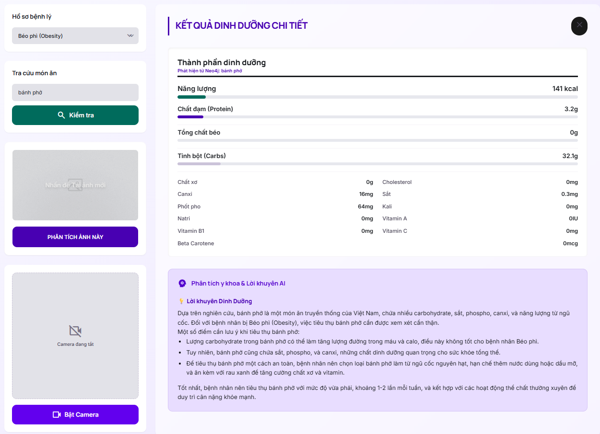

# 🥗 Xây dựng Đồ thị Tri thức Dinh dưỡng Bệnh nhân

> **Đồ án 2 – HK2 (2025–2026)** | Tác giả: Lê Quang Huy – MSSV: 223571

[](https://python.org)
[](https://fastapi.tiangolo.com)
[](https://neo4j.com)
[](https://reactjs.org)
[](https://docker.com)
[](https://groq.com)

---

## 📋 Giới thiệu

**Đồ án "Xây dựng đồ thị tri thức dinh dưỡng bệnh nhân"** là hệ thống tư vấn dinh dưỡng thông minh sử dụng **Knowledge Graph (Đồ thị Tri thức)** và kiến trúc **GraphRAG** để cung cấp lời khuyên dinh dưỡng an toàn, chính xác cho bệnh nhân mắc các bệnh mãn tính.

### Tính năng nổi bật

| Tính năng | Mô tả |
|---|---|
| 🔍 **Tra cứu dinh dưỡng** | Nhập tên món ăn → Nhận ngay 16 chỉ số vi chất + lời khuyên y khoa |
| 📸 **Nhận diện ảnh** | Chụp/upload ảnh món ăn → AI tự nhận diện → Tư vấn (Accuracy 86%) |
| 🧠 **GraphRAG** | Trả lời được gò chặt trong dữ liệu thực tế – **không bao giờ bịa đặt** |
| 🛡️ **Circuit Breaker** | Tự động chặn khi món ăn không có trong CSDL – Zero Hallucination |
| 🗣️ **Tiếng Việt** | Hiểu từ lóng, từ địa phương (VD: "trái thơm" → "dứa") |

### Nhóm bệnh hỗ trợ

🩸 **Tiểu đường** &nbsp;|&nbsp; 💊 **Tăng huyết áp** &nbsp;|&nbsp; 🫘 **Suy thận** &nbsp;|&nbsp; ⚖️ **Béo phì**

---

## 🎬 Demo Hệ thống

### Video Demo Hoạt Động Của Hệ Thống

*(Nhấn trực tiếp vào ảnh bên dưới để xem video `demo.mp4` toàn cảnh hệ thống)*


https://github.com/user-attachments/assets/2848866e-6234-44a8-9129-fac9b00cc0ea


### Giao diện Chatbot



### Màn hình nhận diện ảnh (Vision AI)


---

## 🏗️ Kiến trúc Hệ thống

```
┌──────────────────────────────────────────────────────────────┐
│                        NGƯỜI DÙNG                            │
│                    (Trình duyệt Web)                         │
└───────────────────┬──────────────────────────────────────────┘
                    │ HTTP :80
          ┌─────────▼─────────┐
          │   Nginx Gateway   │
          └────┬─────────┬────┘
               │         │
       ┌───────▼───┐  ┌──▼──────────┐
       │  React 18 │  │  FastAPI    │
       │  Frontend │  │  Backend    │ ← Python 3.11
       └───────────┘  └──┬──────┬───┘
                         │      │
              ┌──────────▼┐   ┌─▼──────────┐
              │  Neo4j KG │   │  Groq API  │
              │ (Graph DB)│   │ Llama 3.3  │
              └───────────┘   └─────────── ┘
                                     │
                              ┌──────▼──────┐
                              │  Jina AI    │
                              │ Embeddings  │
                              └─────────────┘
```

### Pipeline Xây dựng Knowledge Graph (EDC Framework)

```
Văn bản y khoa (.txt)
        │
        ▼
 [Phase 1: OIE]     ← Llama 3.3 trích xuất bộ ba (S, R, O) thô
        │
        ▼
 [Phase 2: SD]      ← Llama 3.3 định nghĩa ngữ nghĩa từng quan hệ
        │
        ▼
 [Phase 3: SC]      ← Jina Embeddings v3 chuẩn hóa về Schema chuẩn
        │
        ▼
 [Deduplication]    ← Cosine Similarity (ngưỡng 0.90)
        │
        ▼
 [Neo4j Import]     ← MERGE Node (Food, Disease, Nutrient, Other)
        │
        ▼
  Knowledge Graph
  500+ thực phẩm, 1000+ Triple quan hệ y khoa
```

---

## 🛠️ Công nghệ sử dụng

| Lớp | Công nghệ | Mục đích |
|---|---|---|
| **Frontend** | React 18 + Vite | Giao diện chatbot, upload ảnh |
| **Backend** | FastAPI (Async) | REST API, xử lý GraphRAG |
| **Database** | Neo4j 5.16 (Graph DB) | Lưu trữ Đồ thị Tri thức |
| **Gateway** | Nginx | Reverse proxy, routing |
| **LLM (Chat)** | Llama 3.3 70B via Groq | Sinh lời khuyên y khoa |
| **LLM (Vision)** | Llama 4 Scout 17B via Groq | Nhận diện ảnh món ăn |
| **Embedding** | Jina Embeddings v3 | Schema Canonicalization |
| **KGC** | EDC Framework | Tự động trích xuất tri thức |
| **Container** | Docker Compose | Deploy toàn bộ hệ thống |

---

## ⚡ Cài đặt và Chạy

### Yêu cầu

- Docker Desktop đã cài đặt và đang chạy
- Python 3.11+ (cho pipeline EDC offline)
- API Keys: `GROQ_API_KEY`, `JINA_KEY`

### Bước 1: Clone và cấu hình

```bash
git clone <repo-url>
cd MyProject

# Tạo file .env từ mẫu
cp .env.example .env
```

Điền các API key vào file `.env`:

```env
GROQ_API_KEY=gsk_xxxxxxxxxxxxxxxxxxxx
JINA_KEY=jina_xxxxxxxxxxxxxxxxxxxx
NEO4J_URI=bolt://nutrition_graph:7687
NEO4J_USERNAME=neo4j
NEO4J_PASSWORD=password
```

### Bước 2: Khởi động hệ thống

```bash
docker-compose up -d
```

Truy cập:
- 🌐 **Giao diện web:** http://localhost
- 📊 **Neo4j Browser:** http://localhost:7474
- 📖 **API Docs (Swagger):** http://localhost:8000/docs

### Bước 3: Import dữ liệu (lần đầu)

```bash
# Import 150+ món ăn từ Excel
docker exec nutrition_backend python import_nutrition_kg.py

# Hoặc chạy pipeline EDC để trích xuất từ văn bản mới
cd edc-main
python run.py --input your_document.txt --sc_embedder jina-embeddings-v3
```

---

## 📁 Cấu trúc thư mục

```
MyProject/
├── 📂 backend/                 # FastAPI Backend
│   ├── app/
│   │   ├── services/
│   │   │   ├── ai_chat.py      # GraphRAG + Semantic Mapping + Circuit Breaker
│   │   │   └── graph_query.py  # Truy vấn Neo4j
│   │   ├── config.py           # Quản lý biến môi trường
│   │   └── main.py             # Khởi động FastAPI
│   └── Dockerfile
├── 📂 frontend-diet/           # React 18 + Vite Frontend
├── 📂 edc-main/                # EDC Framework (Knowledge Graph Construction)
│   ├── edc/                    # Core modules: OIE, SD, SC
│   ├── run.py                  # Điểm khởi chạy pipeline
│   └── split_and_merge.py      # Chia nhỏ văn bản lớn
├── 📂 nginx/                   # Cấu hình Nginx reverse proxy
├── 📂 docs/                    # Tài liệu và ảnh demo
├── 📂 baocao/                  # Báo cáo đồ án (PDF/DOCX)
├── 📄 docker-compose.yml       # Docker Compose
├── 📄 benchmark_latency.py     # Script đo hiệu năng API
└── 📄 .env                     # Biến môi trường (không commit!)
```

---

## 📊 Kết quả đánh giá

| Tiêu chí | Kết quả |
|---|---|
| Vision AI Accuracy (100 ảnh) | **86%** (Món chính: 92.5%) |
| Semantic Mapping Rate (100 truy vấn) | **88%** |
| Circuit Breaker (chặn ảo giác) | **100%** |
| Latency – Avg (Text Query) | **~1.4 giây** |
| Latency – P95 (Text Query) | **~2.1 giây** |

---

## 📚 Tài liệu tham khảo

- Zhang, B. & Soh, H. (2024). *Extract, Define, Canonicalize: An LLM-based Framework for Knowledge Graph Construction.* EMNLP 2024. [arXiv:2404.03868](https://arxiv.org/abs/2404.03868)
- Lewis, P. et al. (2020). *Retrieval-Augmented Generation for Knowledge-Intensive NLP Tasks.* NeurIPS.
- Edge, D. et al. (2024). *From Local to Global: A Graph RAG Approach.* Microsoft Research.
- Viện Dinh Dưỡng Quốc Gia. (2007). *Bảng Thành Phần Thực Phẩm Việt Nam.* NXB Y Học.

---

## 📄 Báo cáo đồ án

| File | Mô tả |
|---|---|
| [`BaoCaoDoAn2_LeQuangHuy_223571.pdf`](baocao/BaoCaoDoAn2_LeQuangHuy_223571.pdf) | Báo cáo đồ án 2 – PDF |
| [`BaoCaoDoAn2_LeQuangHuy_223571.docx`](baocao/BaoCaoDoAn2_LeQuangHuy_223571.docx) | Báo cáo đồ án 2 – DOCX |

---

## 👤 Tác giả

**Lê Quang Huy** – MSSV: 223571  
Đồ án 2 – Ngành Kỹ thuật Phần mềm  
HK2, Năm học 2025–2026

---

