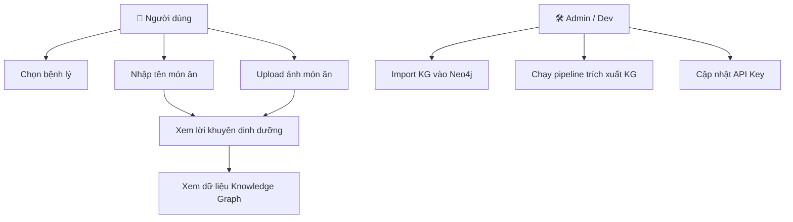
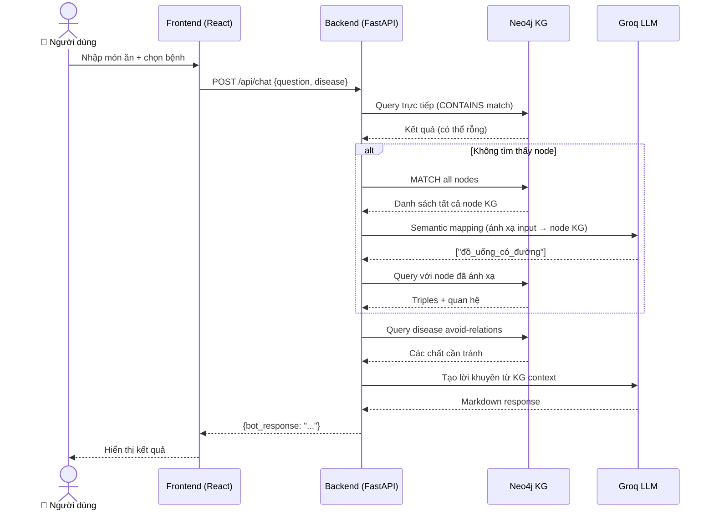
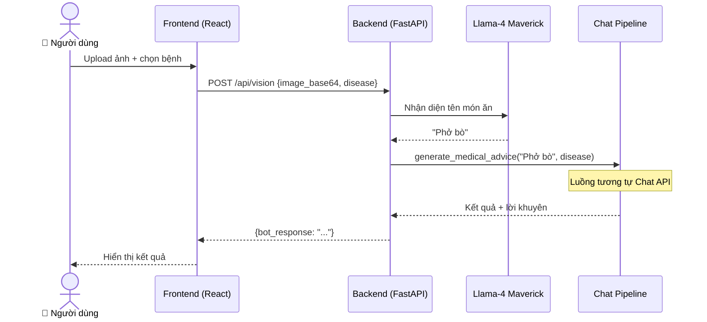
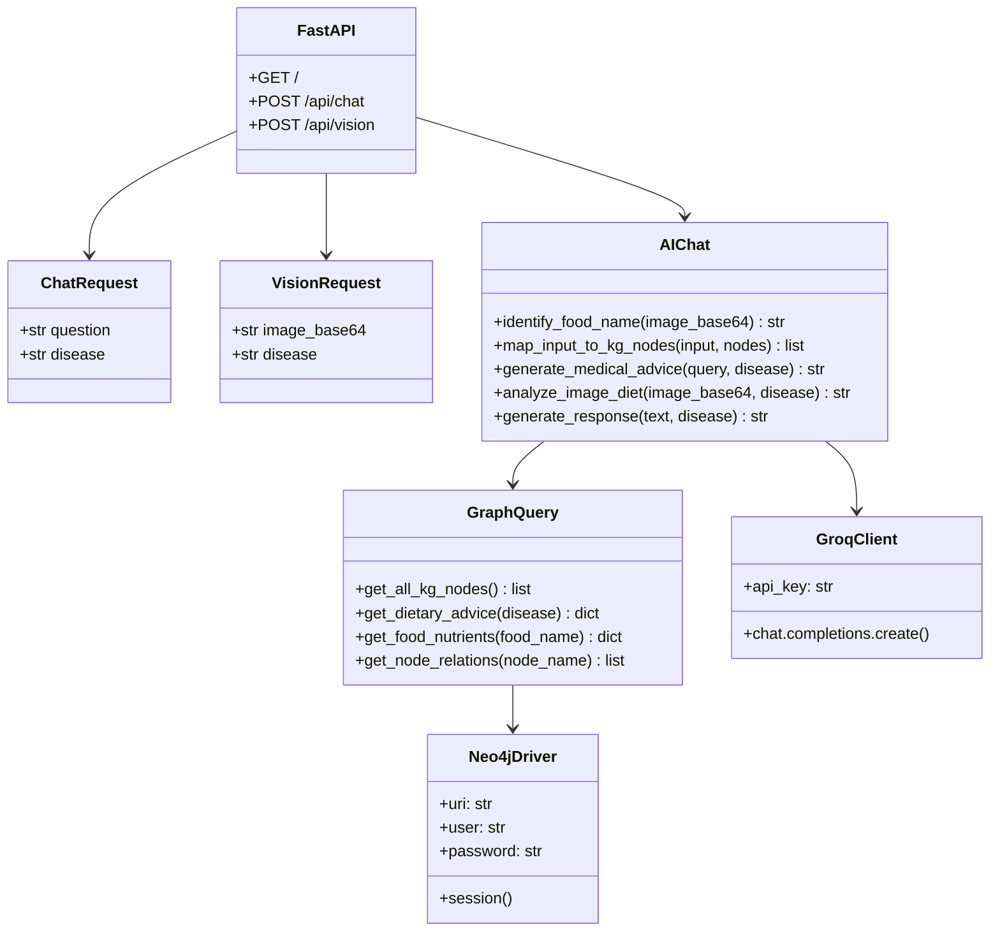
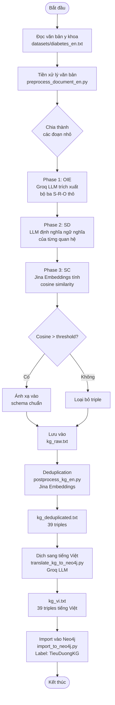
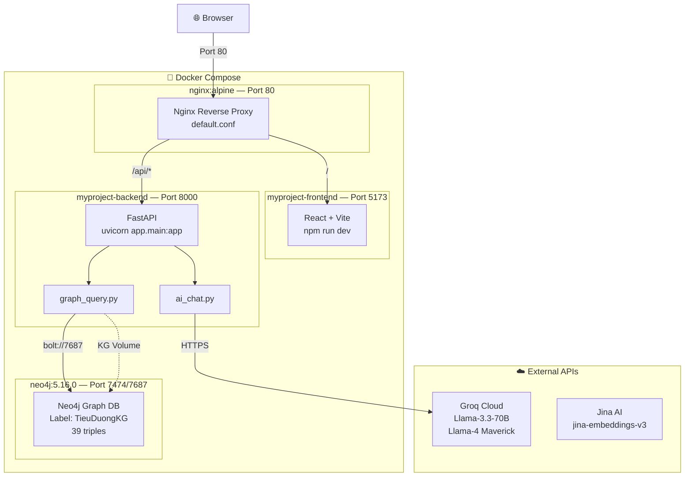

# TIẾN ĐỘ DỰ ÁN
# Hệ Thống Tư Vấn Dinh Dưỡng Thông Minh (AI Nutrition Assistant)

> **Cập nhật lần cuối:** 23/02/2026  
> **Học kỳ:** HK2 (2025–2026)

---

## 📊 TỔNG QUAN TIẾN ĐỘ

| Hạng mục | Tiến độ | Trạng thái |
|----------|---------|-----------|
| Cơ sở hạ tầng (Docker) | 100% | ✅ Hoàn thành |
| Xây dựng Knowledge Graph | 60% | 🔄 Đang làm |
| Backend API | 85% | 🔄 Đang làm |
| Frontend | 70% | 🔄 Đang làm |
| Kiểm thử & Tối ưu | 30% | ⏳ Chưa đủ |
| Tài liệu | 80% | 🔄 Đang làm |

**Tổng tiến độ ước tính: ~65%**

---

## ✅ ĐÃ HOÀN THÀNH

### 🏗️ Cơ sở hạ tầng
- [x] Thiết lập Docker Compose với 4 services: `neo4j`, `backend`, `frontend`, `nginx`
- [x] Cấu hình Nginx reverse proxy (port 80 → backend/frontend)
- [x] Kết nối Neo4j từ Backend qua Bolt protocol

### 🧠 Knowledge Graph Pipeline (EDC Framework)
- [x] Tích hợp framework EDC (Extract–Define–Canonicalize)
- [x] Viết script tiền xử lý văn bản tiếng Anh (`preprocess_document_en.py`)
- [x] Viết script hậu xử lý & deduplication (`postprocess_kg_en.py`) bằng Jina Embeddings
- [x] Xây dựng dataset tiểu đường tiếng Anh (`datasets/diabetes_en.txt`)
- [x] Định nghĩa schema 15 quan hệ dinh dưỡng-bệnh lý (`schemas/nutrition_schema.csv`)
- [x] Trích xuất KG cho bệnh tiểu đường (39 triples)
- [x] Dịch KG sang tiếng Việt bằng Groq LLM (`translate_kg_to_neo4j.py`)
- [x] Import KG vào Neo4j với label `TieuDuongKG` (39 triples tiếng Việt)
- [x] Import KG tiếng Anh với label `TieuDuongKG_EN` (39 triples)

### ⚙️ Backend API (FastAPI)
- [x] Endpoint `POST /api/chat` — Tư vấn dinh dưỡng qua text
- [x] Endpoint `POST /api/vision` — Nhận diện ảnh + tư vấn
- [x] Tích hợp Groq AI (Llama-3.3-70B + Llama-4 Maverick)
- [x] Truy vấn Neo4j theo schema mới (`TieuDuongKG`)
- [x] **Semantic Mapping**: LLM ánh xạ input người dùng → node KG
  - VD: "nước ngọt có ga" → `đồ_uống_có_đường`
- [x] Response format: Tên món → Lời khuyên (LLM) → Dữ liệu KG

### 🎨 Frontend (React + Vite)
- [x] Giao diện chatbot tư vấn dinh dưỡng
- [x] Chức năng chọn bệnh lý
- [x] Upload & phân tích ảnh món ăn
- [x] Hiển thị kết quả định dạng Markdown

### 📄 Tài liệu
- [x] `README.md` — Tổng quan & kiến trúc hệ thống (Chương 1)
- [x] `BÁO_CÁO_DỰ_ÁN.md` — Báo cáo tổng quát

---

## 🔄 ĐANG THỰC HIỆN

### 🧠 Knowledge Graph
- [ ] Mở rộng KG cho các bệnh còn lại (9 bệnh chưa có KG)
  - [ ] Tăng huyết áp (Hypertension)
  - [ ] Bệnh thận mãn tính
  - [ ] Thiếu máu thiếu sắt
  - [ ] Bệnh Celiac
  - [ ] Bệnh Gout
  - [ ] Loãng xương
  - [ ] Gan nhiễm mỡ
  - [ ] Bệnh tuyến giáp
  - [ ] Phenylketon niệu (PKU)
- [ ] Tăng số lượng triples (hiện tại chỉ 39, cần ít nhất 200+)
- [ ] Import dữ liệu thực phẩm Việt Nam vào KG (Food nodes)

### ⚙️ Backend
- [ ] Kiểm thử độ chính xác của Semantic Mapping
- [ ] Xử lý trường hợp bệnh ngoài KG (fallback graceful)
- [ ] Thêm caching để giảm số lần gọi Neo4j

### 🎨 Frontend
- [ ] Cải thiện UX hiển thị kết quả
- [ ] Thêm loading state khi đang xử lý ảnh

---

## ⏳ CHƯA BẮT ĐẦU

### 🧪 Kiểm thử & Đánh giá
- [ ] Viết test cases cho các scenario tư vấn
- [ ] Đánh giá độ chính xác KG (Precision / Recall)
- [ ] Kiểm thử với các câu hỏi thực tế từ người dùng
- [ ] So sánh kết quả KG-grounded vs LLM hallucination

### 📄 Tài liệu còn lại
- [ ] Chương 2: Phương pháp nghiên cứu
- [ ] Chương 3: Kết quả thực nghiệm
- [ ] Chương 4: Kết luận & hướng phát triển
- [ ] Slide thuyết trình

---

## 🐛 VẤN ĐỀ ĐÃ GIẢI QUYẾT

| Ngày | Vấn đề | Giải pháp |
|------|--------|-----------|
| 04/02/2026 | ModuleNotFoundError: neo4j | Cài vào đúng `.venv` |
| 04/02/2026 | JSON encode sai ký tự tiếng Việt | Thêm `ensure_ascii=False` |
| 23/02/2026 | Neo4j auth sai sau khi reset DB | Reset container, dùng pass mặc định `password` |
| 23/02/2026 | Graph query sai schema cũ (Disease/Food) | Cập nhật query dùng label `TieuDuongKG` |
| 23/02/2026 | Vision API 401 Invalid Key | Cập nhật GROQ_API_KEY mới |
| 23/02/2026 | "nước ngọt có ga" không tìm được trong KG | Thêm Semantic Mapping (LLM ánh xạ → node KG) |

---

## 📅 KẾ HOẠCH TIẾP THEO

| Tuần | Mục tiêu |
|------|---------|
| Tuần tới | Mở rộng KG thêm 3-4 bệnh (Hypertension, CKD, Anemia) |
| Tuần tới | Import dữ liệu thực phẩm Việt Nam (100+ món) |
| Sau đó | Kiểm thử hệ thống end-to-end |
| Trước bảo vệ | Hoàn thiện tài liệu & slide |

---

*File này cập nhật thủ công theo tiến độ thực tế của dự án.*

---

## 🔍 PHÂN TÍCH HỆ THỐNG

### 1. Kiến Trúc Tổng Thể

Hệ thống được thiết kế theo mô hình **RAG (Retrieval-Augmented Generation)** kết hợp với **Knowledge Graph**:

```
Người dùng
    │ (câu hỏi / ảnh món ăn)
    ▼
Frontend (React) ──► Nginx (Port 80) ──► Backend (FastAPI)
                                               │
                          ┌────────────────────┼─────────────────────┐
                          ▼                    ▼                     ▼
                    Neo4j KG           Semantic Mapping          Groq LLM
                 (TieuDuongKG)      (LLM ánh xạ node)       (Tạo lời khuyên)
                          │                    │
                          └────────────────────┘
                                    │
                              KG Data Context
                                    │
                                    ▼
                             Groq LLM (llama-3.3-70b)
                             → Format + Generate Advice
                                    │
                                    ▼
                              Kết quả trả về
```

---

### 2. Luồng Xử Lý Chi Tiết

#### 2.1. Chat API (`/api/chat`)

```
Input: {question: "bánh mì", disease: "Tiểu đường"}
  │
  ├─► [B1] Query Neo4j trực tiếp
  │     MATCH (n:TieuDuongKG) WHERE name CONTAINS "bánh mì"
  │
  ├─► [B2] Nếu không tìm thấy → Semantic Mapping
  │     LLM: "bánh mì" → node nào trong KG? → ["tinh_bột_tinh_luyện"]
  │     Query lại Neo4j với node đã ánh xạ
  │
  ├─► [B3] Lấy dữ liệu bệnh
  │     MATCH (a)-[r {relation: "làm trầm trọng"}]->(b) WHERE b.name CONTAINS "tiểu đường"
  │
  └─► [B4] LLM tạo lời khuyên
        - Input: KG triples + bệnh lý + tên món
        - Output: Markdown (tên → lời khuyên → KG data)
```

#### 2.2. Vision API (`/api/vision`)

```
Input: {image_base64: "...", disease: "Tiểu đường"}
  │
  ├─► [B1] Llama-4 Maverick nhận diện ảnh
  │     → "Phở bò"
  │
  └─► [B2] Gọi lại luồng Chat API với tên món vừa nhận diện
```

---

### 3. Phân Tích Từng Thành Phần

#### 3.1. Knowledge Graph (Neo4j)

| Thuộc tính | Hiện tại | Mục tiêu |
|------------|---------|---------|
| Số bệnh lý | 1 (Tiểu đường) | 10 bệnh lý |
| Số triples | 39 | 500+ |
| Ngôn ngữ | Tiếng Việt + Anh | Tiếng Việt (chính) |
| Loại quan hệ | 15 kiểu | 15 kiểu (giữ nguyên) |
| Food nodes | Chưa có | 100+ món Việt Nam |

**Điểm mạnh:**
- Schema rõ ràng, 15 quan hệ có nghĩa y tế chính xác
- Dữ liệu được trích xuất từ tài liệu y khoa (không phải tự bịa)
- Tách biệt KG tiếng Anh và tiếng Việt bằng label

**Điểm yếu:**
- Số lượng triples còn ít (39), chưa đủ phủ nhiều câu hỏi
- Chưa có Food nodes → không tư vấn được theo món ăn cụ thể

#### 3.2. Semantic Mapping

| Tình huống | Xử lý |
|-----------|-------|
| Query khớp trực tiếp (`tiểu_đường`) | Query Neo4j ngay |
| Query gần đúng (`đường huyết`) | `toLower() CONTAINS` match |
| Query khác tầm trừu tượng (`nước ngọt có ga`) | LLM map → `đồ_uống_có_đường` → Neo4j |
| Hoàn toàn ngoài KG | Thông báo rõ, không hallucinate |

**Độ trễ thêm từ Semantic Mapping:** ~1-2 giây (1 lần gọi LLM thêm)

#### 3.3. Backend API

| Endpoint | Latency ước tính | Bottleneck |
|----------|-----------------|------------|
| `/api/chat` (có KG data) | ~2-3s | Groq API |
| `/api/chat` (cần mapping) | ~4-5s | 2 lần gọi LLM |
| `/api/vision` | ~5-7s | Vision model + chat |

---

### 4. So Sánh Hướng Tiếp Cận

| Tiêu chí | Chỉ dùng LLM | KG + LLM (hiện tại) |
|----------|-------------|---------------------|
| Độ tin cậy | ❌ Có thể hallucinate | ✅ Grounded trong KG |
| Phủ rộng câu hỏi | ✅ Rộng | ⚠️ Giới hạn theo KG |
| Giải thích nguồn gốc | ❌ Không rõ | ✅ Hiện node + quan hệ |
| Chi phí API | Thấp hơn | Cao hơn (nhiều lần gọi) |
| Cập nhật tri thức | Khó | Dễ (thêm triples vào Neo4j) |

---

### 5. Điểm Cần Cải Thiện

| Ưu tiên | Vấn đề | Giải pháp đề xuất |
|---------|--------|-------------------|
| 🔴 Cao | KG quá ít triples (39) | Thêm text → chạy pipeline EDC |
| 🔴 Cao | Thiếu Food nodes trong KG | Import `food_data.xlsx` vào Neo4j |
| 🟡 Trung bình | Semantic Mapping chậm | Cache kết quả mapping |
| 🟡 Trung bình | Không có fallback khi Groq rate limit | Retry logic + timeout |
| 🟢 Thấp | Frontend chưa có loading indicator | Thêm spinner cho Vision API |

---

### 6. Rủi Ro Dự Án

| Rủi ro | Mức độ | Giảm thiểu |
|--------|--------|-----------|
| Groq API rate limit | Trung bình | Có thể dùng key khác hoặc thêm delay |
| KG triples không đủ phủ → UX kém | Cao | Ưu tiên mở rộng KG |
| Semantic mapping sai → tư vấn sai | Trung bình | Hiển thị node được ánh xạ để user kiểm tra |
| Docker container crash (Neo4j) | Thấp | Volume mount đã được cấu hình |

---

## 📐 SƠ ĐỒ UML

### 1. Use Case Diagram — Các trường hợp sử dụng



---

### 2. Sequence Diagram — Luồng Chat API



---

### 3. Sequence Diagram — Luồng Vision API



---

### 4. Class Diagram — Backend Components



---

### 5. Activity Diagram — Pipeline Xây Dựng KG



---

### 6. Deployment Diagram — Docker Services



