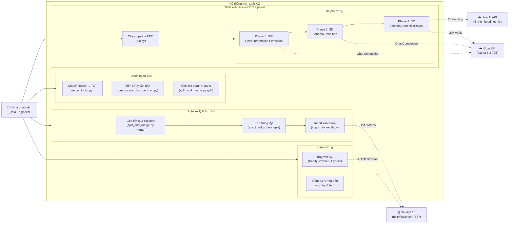
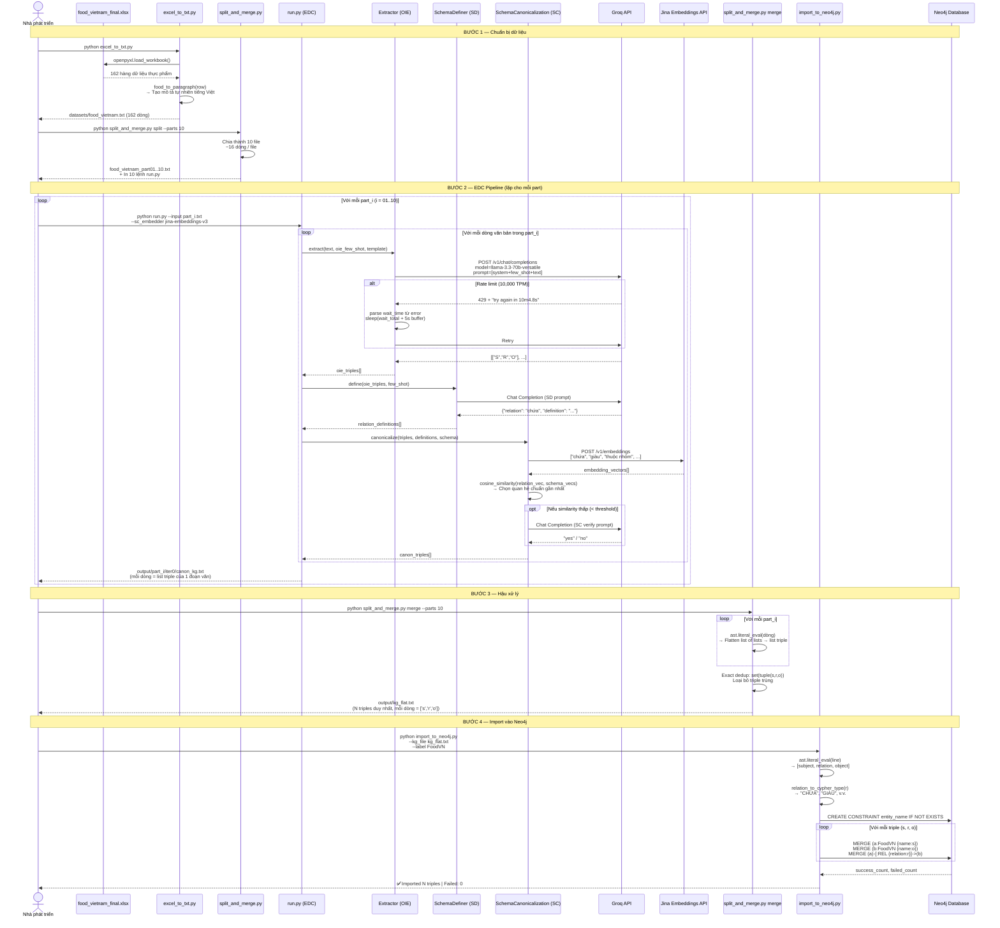
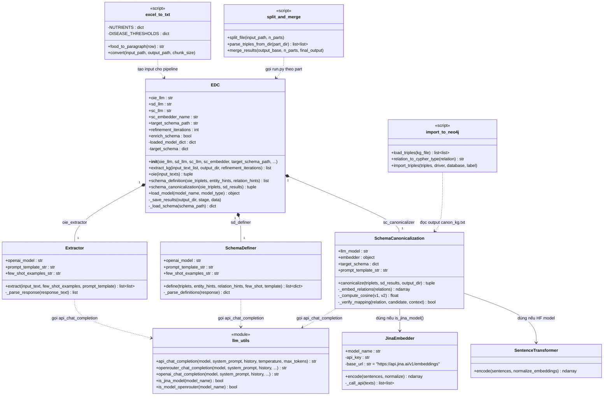
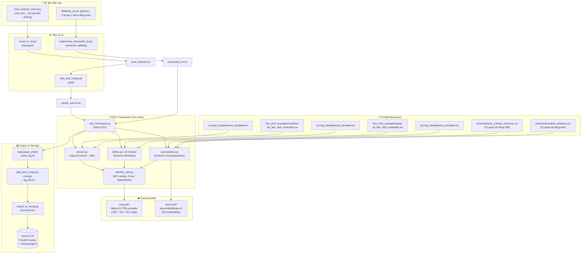

# PHÂN TÍCH HỆ THỐNG: PIPELINE TRÍCH XUẤT KNOWLEDGE GRAPH

> **Đồ Án 2 — Hệ Thống Tư Vấn Dinh Dưỡng Thông Minh**
> Tài liệu: Phân tích thiết kế module xây dựng Đồ Thị Tri Thức (KG)

---

## 1. TỔNG QUAN MODULE

### 1.1. Mục tiêu

Module trích xuất Knowledge Graph (KG) chịu trách nhiệm **tự động chuyển đổi dữ liệu văn bản phi cấu trúc** (tài liệu y khoa tiếng Anh, bảng dinh dưỡng thực phẩm tiếng Việt) thành **đồ thị tri thức có cấu trúc** lưu trong Neo4j, phục vụ cho hệ thống tư vấn dinh dưỡng theo bệnh lý.

### 1.2. Hai luồng dữ liệu song song

| Luồng | Nguồn dữ liệu | Schema | Label Neo4j |
|-------|--------------|--------|-------------|
| **Luồng 1** | Tài liệu y khoa tiếng Anh (`diabetes_en.txt`, GERD, v.v.) | `nutrition_schema.csv` (15 quan hệ) | `TieuDuongKG` |
| **Luồng 2** | Excel thực phẩm Việt Nam (`food_vietnam_final.xlsx`) | `food_nutrition_schema.csv` (12 quan hệ) | `FoodVN` |

### 1.3. Framework sử dụng: EDC

Pipeline sử dụng framework **EDC (Extract–Define–Canonicalize)** với 3 pha xử lý nối tiếp nhau:

```
Văn bản đầu vào
       ↓
  [Phase 1: OIE]   → Trích xuất bộ ba thô (Subject, Relation, Object)
       ↓
  [Phase 2: SD]    → Định nghĩa ngữ nghĩa từng quan hệ
       ↓
  [Phase 3: SC]    → Ánh xạ quan hệ về schema chuẩn (Canonicalization)
       ↓
  canon_kg.txt     → Tập triple đã được chuẩn hoá
```

---

## 2. SƠ ĐỒ USE CASE



---

## 3. SƠ ĐỒ SEQUENCE — LUỒNG XỬ LÝ ĐẦY ĐỦ

### 3.1. Luồng 2: Dữ liệu thực phẩm Việt Nam (Food KG)



---

## 4. SƠ ĐỒ CLASS — EDC FRAMEWORK



---

## 5. SƠ ĐỒ ACTIVITY — QUY TRÌNH TRÍCH XUẤT KB THỰC PHẨM

```mermaid
flowchart TD
    Start(["🟢 Bắt đầu"]) --> CheckExcel

    CheckExcel{"File Excel\nđã có chưa?"}
    CheckExcel -->|Chưa| GetData["📥 Thu thập dữ liệu thực phẩm\nVietnam (163 món)"]
    GetData --> CheckExcel
    CheckExcel -->|Có| RunPrep

    RunPrep["🔄 Chạy excel_to_txt.py\nĐọc từng hàng Excel\n→ Tạo đoạn văn mô tả tiếng Việt\n→ Lưu food_vietnam.txt"]

    RunPrep --> ValidateTxt{"Kiểm tra\nfood_vietnam.txt"}
    ValidateTxt -->|"Thiếu dòng / lỗi encoding"| FixPrep["🔧 Sửa excel_to_txt.py\n(xử lý NaN, dấu phẩy thập phân)"]
    FixPrep --> RunPrep
    ValidateTxt -->|"✅ 162 dòng hợp lệ"| RunSplit

    RunSplit["✂️ Chạy split_and_merge.py split\n--parts 10\n→ Tạo part01..part10.txt\n→ In 10 lệnh run.py"]

    RunSplit --> Loop

    subgraph Loop["🔁 Vòng lặp — Chạy EDC cho mỗi part"]
        direction TB
        NextPart{"Còn part\nchưa xử lý?"}
        NextPart -->|Có| SetEnv["⚙️ Đặt biến môi trường\n$env:GROQ_KEY=...\n$env:JINA_KEY=..."]
        SetEnv --> RunEDC["🚀 python run.py\n--input part_i.txt\n--sc_embedder jina-embeddings-v3\n--output_dir output/part_i"]

        RunEDC --> Phase1["Phase 1: OIE\nGroq LLM trích xuất\nbộ ba (S, R, O) thô\ntừ mỗi đoạn văn"]
        Phase1 --> Phase2["Phase 2: SD\nGroq LLM định nghĩa\nngữ nghĩa quan hệ\ncho mỗi triple"]
        Phase2 --> CheckRate{"Rate limit\nGroq API?"}
        CheckRate -->|"429 + wait time"| ParseWait["⏳ Parse wait_time\ntừ error message\n(regex: 'try again in Xm Y.Zs')\nsleep(wait + 5s)"]
        ParseWait --> Phase2
        CheckRate -->|"200 OK"| Phase3

        Phase3["Phase 3: SC\nJina embed quan hệ\n→ Cosine với schema chuẩn\n→ LLM verify nếu cần\n→ Ánh xạ về 12 quan hệ"]

        Phase3 --> SaveCanon["💾 Lưu canon_kg.txt\noutput/part_i/iter0/\nMỗi dòng = list triples\ncủa 1 đoạn văn"]
        SaveCanon --> NextPart
        NextPart -->|"Không (tất cả xong)"| EndLoop
        EndLoop(["Kết thúc vòng lặp"])
    end

    Loop --> RunMerge

    RunMerge["🔀 Chạy split_and_merge.py merge\n--parts 10\n→ Đọc 10 canon_kg.txt\n→ ast.literal_eval mỗi dòng\n→ Flatten list of lists\n→ Exact dedup tuple(s,r,o)"]

    RunMerge --> CheckFlat{"kg_flat.txt\nhợp lệ?"}
    CheckFlat -->|"0 triples"| DebugMerge["🔍 Debug: Kiểm tra\ncanon_kg.txt có dữ liệu không"]
    DebugMerge --> RunMerge
    CheckFlat -->|"N > 0 triples"| StartNeo4j

    StartNeo4j["🐳 docker start nutrition_graph\nChờ Neo4j sẵn sàng (~15s)"]
    StartNeo4j --> RunImport

    RunImport["📤 python import_to_neo4j.py\n--kg_file kg_flat.txt\n--password password\n--label FoodVN"]

    RunImport --> CheckImport{"Kết nối\nthành công?"}
    CheckImport -->|"ServiceUnavailable"| StartNeo4j
    CheckImport -->|"AuthError"| FixPassword["🔧 Kiểm tra password\n(mặc định: 'password'\ntheo docker-compose.yml)"]
    FixPassword --> RunImport
    CheckImport -->|"✅ Connected"| Merge["MERGE nodes + relationships\nvào Neo4j"]

    Merge --> Verify["🔍 Kiểm tra Neo4j Browser\nhttp://localhost:7474\nMATCH (n:FoodVN)-[r]->(m:FoodVN)\nRETURN n,r,m LIMIT 50"]

    Verify --> TestAPI["🧪 Test API tư vấn\nPOST /api/chat\n{food: 'Gạo nếp cái',\ndisease: 'Tiểu đường'}"]

    TestAPI --> Done(["🔴 Kết thúc"])
```



---

## 6. SƠ ĐỒ THÀNH PHẦN (Component Diagram)



---

## 7. SCHEMA ĐỊNH NGHĨA QUAN HỆ

### 7.1. Food Nutrition Schema (Luồng 2 — Tiếng Việt)

File: `edc-main/schemas/food_nutrition_schema.csv`

| STT | Quan hệ | Định nghĩa |
|-----|---------|-----------|
| 1 | `chứa` | Thực phẩm (subject) chứa dưỡng chất hoặc thành phần dinh dưỡng (object) |
| 2 | `giàu` | Thực phẩm (subject) là nguồn giàu dưỡng chất (object), hàm lượng cao hơn mức trung bình |
| 3 | `thuộc nhóm` | Thực phẩm (subject) thuộc nhóm hoặc loại thực phẩm (object) |
| 4 | `làm trầm trọng` | Thực phẩm (subject) có thể làm trầm trọng thêm hoặc tăng nguy cơ bệnh lý (object) |
| 5 | `được khuyến nghị cho` | Thực phẩm (subject) được khuyến nghị hoặc có lợi cho người mắc bệnh (object) |
| 6 | `cần hạn chế ở` | Bệnh nhân mắc bệnh (subject) cần hạn chế hoặc tránh sử dụng thực phẩm (object) |
| 7 | `phòng ngừa` | Thực phẩm hoặc dưỡng chất (subject) giúp phòng ngừa bệnh lý (object) |
| 8 | `nhiều` | Thực phẩm (subject) có hàm lượng cao của chỉ số dinh dưỡng (object) |
| 9 | `ít` | Thực phẩm (subject) có hàm lượng thấp của chỉ số dinh dưỡng (object) |
| 10 | `hỗ trợ` | Dưỡng chất hoặc thực phẩm (subject) hỗ trợ chức năng hoặc quá trình sinh lý (object) |
| 11 | `ảnh hưởng đường huyết` | Thực phẩm (subject) ảnh hưởng đến mức đường huyết theo chiều hướng (object) |
| 12 | `chống chỉ định với` | Thực phẩm (subject) chống chỉ định hoặc cần tránh hoàn toàn ở bệnh nhân mắc (object) |

### 7.2. Nutrition Schema (Luồng 1 — Tiếng Anh)

File: `edc-main/schemas/nutrition_schema.csv`

| Quan hệ | Ý nghĩa |
|---------|---------|
| `treats` | hỗ trợ điều trị |
| `prevents` | phòng ngừa |
| `aggravates` | làm trầm trọng |
| `recommended for` | được khuyến nghị cho |
| `contraindicated for` | chống chỉ định với |
| `deficiency causes` | thiếu hụt gây ra |
| `enhances absorption of` | tăng cường hấp thu |
| `restricts` | cần hạn chế ở (bệnh lý → thực phẩm/dưỡng chất) |
| `requires` | cần bổ sung ở |
| `contains` | cung cấp / chứa |
| `reduces` | làm giảm |
| `associated with` | là yếu tố nguy cơ của |
| `daily intake` | lượng khuyến nghị hàng ngày |
| `food source` | nguồn thực phẩm |
| `symptom of` | là triệu chứng của |

---

## 8. CẤU TRÚC THƯ MỤC MODULE KG

```
edc-main/
│
├── 📄 run.py                          # Entry point EDC pipeline
├── 📄 excel_to_txt.py                 # Excel → text paragraphs
├── 📄 split_and_merge.py              # Split input / Merge output KG
├── 📄 import_to_neo4j.py              # Flat triples → Neo4j
├── 📄 preprocess_document_en.py       # English doc preprocessing
├── 📄 postprocess_kg_en.py            # Semantic dedup via Jina embeddings
├── 📄 translate_kg_to_neo4j.py        # Translate EN→VI + import
│
├── 📁 edc/                            # EDC Framework core
│   ├── edc_framework.py               # Class EDC (orchestrator)
│   ├── extract.py                     # Class Extractor (OIE)
│   └── utils/
│       └── llm_utils.py               # API routing (Groq/OpenRouter/Jina)
│
├── 📁 datasets/                       # Input texts
│   ├── food_vietnam.txt               # 162 food descriptions (VI)
│   ├── food_vietnam_part01..10.txt    # Parts for batch processing
│   └── diabetes_en.txt, gerd.txt...   # Medical docs (EN)
│
├── 📁 schemas/                        # Relation schemas (CSV)
│   ├── food_nutrition_schema.csv      # 12 Vietnamese relations
│   ├── nutrition_schema.csv           # 15 English relations
│   └── gerd_schema_vi.csv             # GERD-specific schema
│
├── 📁 few_shot_examples/              # Few-shot prompts
│   ├── nutrition/oie_few_shot_examples.txt
│   ├── gerd/oie_few_shot_examples.txt
│   └── gerd/sd_few_shot_examples.txt
│
├── 📁 prompt_templates/               # LLM prompt templates
│   ├── oie_template.txt
│   ├── sd_template.txt
│   └── sc_template.txt
│
└── 📁 output/                         # Pipeline outputs
    ├── food_vietnam_kg/
    │   ├── part01/iter0/canon_kg.txt  # Per-part KG output
    │   ├── ...
    │   └── kg_flat.txt                # Final merged + deduped KG
    └── diabetes_en_kg/
        └── iter0/
            ├── oie_kg.txt
            ├── kg_deduplicated.txt
            └── kg_vi.txt              # Translated Vietnamese KG
```

---

## 9. MÔ TẢ DỮ LIỆU ĐẦU VÀO & ĐẦU RA

### 9.1. Định dạng đầu vào (`food_vietnam_partXX.txt`)

Mỗi dòng là một đoạn văn mô tả 1 món ăn, ví dụ:

```
Gạo nếp cái là một thực phẩm thuộc nhóm Ngũ cốc và sản phẩm chế biến từ chúng.
Thành phần dinh dưỡng trong 100g Gạo nếp cái bao gồm: năng lượng: 346.0 kcal,
protein: 8.6 g, chất béo: 1.5 g, carbohydrate: 74.9 g, chất xơ: 0.6 g, canxi: 14.0 mg,
phospho: 147.0 mg, sắt: 0.9 mg, natri: 5.0 mg, kali: 132.0 mg, vitamin B1: 0.2 mg.
Hàm lượng carbohydrate cao (74.9 g) trong Gạo nếp cái có thể ảnh hưởng đến đường huyết,
người bệnh tiểu đường cần thận trọng khi sử dụng.
```

### 9.2. Định dạng trung gian (`canon_kg.txt`)

Mỗi dòng là một danh sách Python các triple, tương ứng với 1 đoạn văn đầu vào:

```python
[['Gạo_nếp_cái', 'chứa', 'năng_lượng'], ['Gạo_nếp_cái', 'chứa', 'protein'],
 ['Gạo_nếp_cái', 'chứa', 'carbohydrate'], ['Gạo_nếp_cái', 'thuộc nhóm', 'Ngũ cốc'],
 ['Gạo_nếp_cái', 'ảnh hưởng đường huyết', 'tăng'], ['Gạo_nếp_cái', 'cần hạn chế ở', 'Tiểu đường']]
```

### 9.3. Định dạng flat (`kg_flat.txt`) — Input cho Neo4j

Mỗi dòng là **1 triple duy nhất** dạng list Python:

```python
['Gạo_nếp_cái', 'chứa', 'năng_lượng']
['Gạo_nếp_cái', 'chứa', 'protein']
['Gạo_nếp_cái', 'thuộc nhóm', 'Ngũ cốc']
['Gạo_nếp_cái', 'ảnh hưởng đường huyết', 'tăng']
```

### 9.4. Cấu trúc Neo4j sau khi import

```cypher
// Node
(:FoodVN {name: "Gạo_nếp_cái"})
(:FoodVN {name: "Tiểu_đường"})
(:FoodVN {name: "carbohydrate"})

// Relationship
(:FoodVN {name:"Gạo_nếp_cái"})-[:CẦN_HẠN_CHẾ_Ở {relation:"cần hạn chế ở"}]->(:FoodVN {name:"Tiểu_đường"})
(:FoodVN {name:"Gạo_nếp_cái"})-[:CHỨA {relation:"chứa"}]->(:FoodVN {name:"carbohydrate"})
```

---

## 10. CÁC VẤN ĐỀ KỸ THUẬT VÀ CÁCH XỬ LÝ

| Vấn đề | Nguyên nhân | Giải pháp |
|--------|-------------|-----------|
| **Rate limit Groq API** | Free tier: 10,000 tokens/phút | `llm_utils.py` parse thời gian chờ từ lỗi, auto-sleep |
| **Disk đầy (14GB model)** | `--sc_embedder` mặc định tải `e5-mistral-7b-instruct` (14.2GB) | Dùng `--sc_embedder jina-embeddings-v3` (API, không tải local) |
| **Encoding UTF-8** | Tiếng Việt bị lỗi trong pipeline gốc (ASCII) | Cấu hình `encoding="utf-8"` tất cả file read/write |
| **Trùng lặp triple** | Nhiều đoạn văn mô tả cùng quan hệ | Exact dedup bằng `set(tuple(s,r,o))` trong merge |
| **Neo4j không kết nối** | Container `nutrition_graph` bị tắt | `docker start nutrition_graph` và chờ 15s |
| **Format canon_kg.txt** | Mỗi dòng là list-of-lists, không phải flat | `split_and_merge.py` dùng `ast.literal_eval` + flatten |

---

*Tài liệu được tạo ngày: 24/02/2026*
